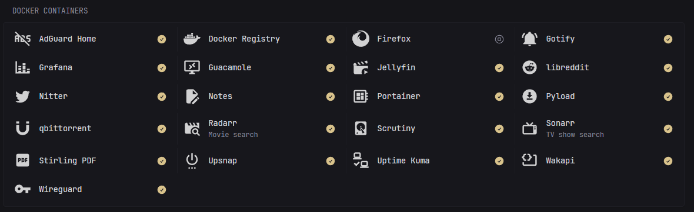

glance-docker-container-ext
===

[Glance](https://github.com/glanceapp/glance) extension that creates a widget that displays the Docker containers running.



## Installation

Assuming you are using Docker compose, add the following to your `docker-compose.yml` file containing Glance container:

```yaml
  glance-docker-container-ext:
    image: ghcr.io/dvdandroid/glance-docker-container-ext
    container_name: glance-docker-container-ext
    restart: unless-stopped
    environment:
      - DOCKER_HOST=unix:///var/run/docker.sock
      - PORT=8081 # Optional, default is 8081
    volumes:
      - /var/run/docker.sock:/var/run/docker.sock
```

then in your `glance.yml` config file, add the following:

```yaml
  - type: extension
    allow-potentially-dangerous-html: true
    url: http://glance-docker-container-ext:8081
    cache: 5m
    parameters:
      title: Docker Containers
      all: true
      order: name,status
```

### Parameters

| Parameter       | Description                                                                                                              | Default             |
|-----------------|--------------------------------------------------------------------------------------------------------------------------|---------------------|
| `title`         | Title of the widget                                                                                                      | "Docker Containers" |
| `all`           | Show all containers or only running ones                                                                                 | `true`              |
| `order`         | Order of the containers, comma separated **string** of `name`, `status`<br>(`name`,`status`,`name,status`,`status,name`) | `name`              |
| `same-tab`      | Open the URL in the same tab. Value customizable per container                                                           | `false`             |
| `ignore-status` | Status of the containers will not be displayed                                                                           | `false`             |

## Configuration

Then, for every container you want to monitor, add the following labels:

```yaml
    labels:
      glance.enable: true
      glance.name: Sonarr
      glance.description: TV show search
      glance.url: http://sonarr.lan
      glance.icon: ./assets/imgs/television-classic.svg
```

| Label                | Description                                                       | Default        |
|----------------------|-------------------------------------------------------------------|----------------|
| `glance.enable`      | Enable monitoring for this container                              |                |
| `glance.name`        | Name of the container                                             | container name |
| `glance.description` | Description of the container                                      |                |
| `glance.url`         | URL to open when clicking on the container                        |                |
| `glance.icon`        | Icon to display, pointing to assets or Simple Icon (`si:` prefix) |                |
| `glance.same-tab`    | Open the URL in the same tab                                      | `false`        |

